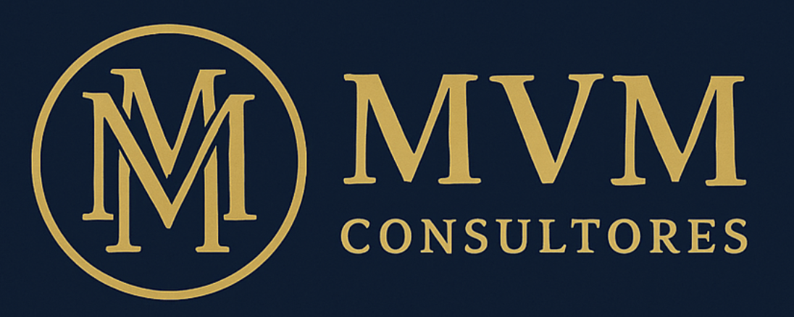

# 🏢 MVM Consultores - Sitio Web Corporativo 🚀



## 📋 Descripción del Proyecto

Este proyecto es un sitio web corporativo moderno y profesional para MVM Consultores, una firma especializada en transformación de empresas familiares en organizaciones de clase mundial. La página web presenta una estructura simple y eficiente con un diseño responsivo que se adapta a cualquier dispositivo.

## ✨ Características Principales

- 🎯 **Diseño Minimalista y Profesional**: Interfaz limpia con enfoque en la experiencia del usuario
- 📱 **Completamente Responsivo**: Adaptado para dispositivos móviles, tablets y escritorio
- 🔍 **SEO Optimizado**: Meta etiquetas y estructura semántica para mejor posicionamiento
- 🌟 **Animaciones Elegantes**: Implementadas con la biblioteca AOS (Animate On Scroll)
- 📊 **Presentación de Datos Estadísticos**: Visualización atractiva de información económica
- 📝 **Formulario de Contacto**: Sistema de comunicación directo con potenciales clientes

## 🛠️ Tecnologías Utilizadas

- **HTML5**: Estructura semántica moderna
- **CSS3**: Estilos avanzados con variables CSS personalizadas
- **JavaScript**: Interacciones dinámicas y mejora de experiencia de usuario
- **Font Awesome**: Iconografía vectorial escalable
- **Google Fonts**: Tipografía Montserrat para un aspecto profesional
- **AOS Library**: Animaciones al hacer scroll

## 📚 Estructura del Proyecto

```
/
├── index.html         # Documento principal HTML
├── styles.css         # Estilos CSS unificados
├── scripts.js         # Funcionalidades JavaScript
├── logo.png           # Logo de la empresa
├── favicon.svg        # Favicon vectorial
└── README.md          # Documentación del proyecto
```

## 📋 Secciones del Sitio

1. 🏠 **Cabecera**: Logo y menú de navegación con toggle para dispositivos móviles
2. 🌟 **Hero**: Presentación principal con mensaje clave y llamado a la acción
3. 🛠️ **Servicios**: Presentación de los 3 servicios clave con tarjetas interactivas
   - Institucionalización
   - Profesionalización
   - Transformación Digital
4. 📊 **Insights**: Datos económicos estratégicos de Sonora
5. 👥 **Sobre Nosotros**: Información sobre la empresa y metodología MVM-360™
6. ✉️ **Contacto**: Formulario de contacto para potenciales clientes
7. 👣 **Pie de Página**: Copyright y enlaces a redes sociales

## 🔍 Características Técnicas

- **Navegación Inteligente**: Resaltado automático de secciones activas durante el scroll
- **Menú Móvil**: Funcionalidad completa de navegación en dispositivos móviles
- **Optimización de Rendimiento**: Carga diferida (lazy loading) de imágenes
- **Fallbacks**: Sistema de respaldo para recursos externos no disponibles
- **Scroll Suave**: Navegación fluida entre secciones

## 🚀 Cómo Usar

1. Clonar este repositorio
2. Abrir `index.html` en un servidor local (como VS Code Live Server)
3. Navegar por el sitio para explorar todas sus características

## 📈 Datos de Contacto

- **Cliente**: MVM Consultores
- **Año**: 2025
- **Industria**: Consultoría Empresarial
- **Enfoque**: Empresas Familiares en Sonora, México

## 📝 Notas Adicionales

El sitio ha sido optimizado para funcionar con VS Code Live Server y mantiene una estructura simplificada para fácil mantenimiento y actualización.

---

⭐️ **Desarrollado con ❤️ para MVM Consultores** ⭐️
